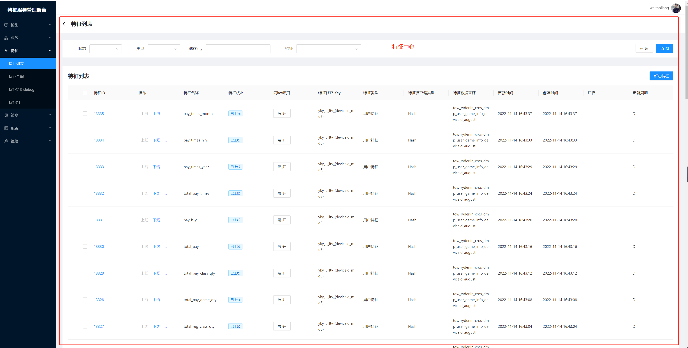

###整体说明

meta-feature-store项目是支撑我们游可盈游戏广告推荐业务的特征样本工程sdk代码，采用scala、java语言开发
包括统一离线特征生产sdk、统一实时特征生产sdk、统一样本工程、在线学习引擎、特征平台等模块。
该项目旨在打造一个开源的特征服务平台，基于很多公司都有自己的推荐业务场景，一个通用的特征服务平台可以帮助团队快速进行特征工程构建，并且可以借助特征服务平台进行特征共享，
告别烟囱式的开发模式，制定出一套标准的特征存储格式及搭建一套完整的特征监控体系，帮助业务快速实现业务目标，提高开发效率及数据质量。这个项目是算法MLops中的其中数据
流处理的核心模块，主要负责特征的自动化生产（实时、离线）、注册、管理、样本的构建、在线特征获取、特征管理平台前后端部分等各个部分。以maven依赖的形式对外提供，
使用者只需要引用相关依赖即可使用。

项目中使用的存储和计算引擎为：
离线存储：TDW、Hive、Hbase
批计算引擎：Spark
实时处理引擎：SparkStreaming、Flink
特征存储：Redis
消息队列：kafka、tdbank

###目录结构
项目使用java9 module特性，参考Spark、Flink等开源项目目录结构，进行类库解耦和隔离，进行功能拆箱建设和使用,分为以下几个子module：

1、【feature-common】:

此模块主要实现统一特征标准体系的抽象和设计、各类数据库的优化连接器、各类工具集（压缩、序列化、redis限速器、机器学习工具），这个模块是基础模块，定义了特征的存储和获取规则，
并且定义了特征的注册，是meta特征平台的基础设计。其他模块通过引用它依赖进行使用，项目定义的特征工程标准体系适合所有推荐项目。
具体设计文档请参考：https://iwiki.woa.com/pages/viewpage.action?pageId=1065449094
业务使用如下依赖进行特征生产

        <dependency>
            <groupId>com.tencent.meta</groupId>
            <artifactId>feature-common</artifactId>
            <version>1.0-SNAPSHOT</version>
        </dependency>
2、【feature-offline】:

此模块主要实现统一离线特征生产框架，将Raw 数据抽取转化为一个特征，在特征平台注册为一个新特征元数据信息（Metadata），
描述了这个特征存储的方式、数据类型，长度，默认值等，并且可以对该特征设置多项目共享，达到特征复用的目的。根据特征的标准化格式我们进行元数据抽象，形成离线特征生产SDK。
告别烟囱模式开发，业务的离线特征生产依赖这个模块进行生产

        <dependency>
            <groupId>com.tencent.meta</groupId>
            <artifactId>feature-offline</artifactId>
            <version>1.0-SNAPSHOT</version>
        </dependency>
        
特征生产注册完成之后会在我们特征模型管理平台进行收录：

平台地址https://fsp.woa.com/

3、【feature-online】

此模块主要实现统一实时特征生产框架，主要包括Hbase样本存储rowKey设计工具、kafka源实时特征处理（常规特征、ctr点击特征、序列特征）、kafka2Hbase、
kafka2Kaka、kafka同步、异步处理、kafka数据源等模板工具、实时任务监控组件、streaming本地mock工具、为实现延迟消息处理重写的spark原生类（重点）、
基于redis实现的kafka offset记录工具（重点），基于完整的上层封装及统一性能优化，用户基于这些工具包即可高效完整的生产实时特征。业务实时特征生产可以依赖这个模块进行生产
       
        <dependency>
            <groupId>com.tencent.meta</groupId>
            <artifactId>feature-online</artifactId>
            <version>1.0-SNAPSHOT</version>
        </dependency>
        
4、【feature-flow】

此模块主要基于前三个模块，进行算法MLops建设，主要通过xml配置文件的形式进行特征获取处理和样本生产，配置文件格式参考
[配置文件](../feature-flow\src\test\resources\featureflow.xml)，这样做的目的就是减少特征生产的人工错误以及线上线下统一采用
配置文件进行特征获取进而保证线上线下一致性。此流程是我们特征模型管理平台的后台sdk。主要包括配置文件的定义、配置文件的读取、特征获取处理ETL模板类DataFlowDriver，
以及预定义的item特征收集器模板RedisItemFeature2Hbase

，页面展示如下

业务特征获取处理和样本生产依赖这个模块进行生产

        <dependency>
            <groupId>com.tencent.meta</groupId>
            <artifactId>feature-flow</artifactId>
            <version>1.0-SNAPSHOT</version>
        </dependency>

5、【feature-web】

此模块主要是MLOps平台 https://fsp.woa.com/ 的建设，这里的代码还没有迁移进来，是前后端同学进行维护

###详细说明

###代码功能

###改进点和优化点
整体的特征、样本生产体系采用的传统的lambda架构进行生产，采用hadoop+spark（离线）以及MQ+sparkStreaming/Flink（实时）两套链路进行特征和样本生产
实际特征的生产，随着数据湖技术日益成熟，流批一体得以在项目落地，后续我会重构离线、实时特征生产体系，采用Flink + iceBerg的形式进行合并【feature-offline】、
【feature-online】两个模块，进行流批计算的统一和特征计算的统一sdk。另外就是redis、tdw、kafka、tdbank等存储因为业务数据架构几年内基本不会变化，所以没有针对数据源
进行再上层封装，因为如果要新增基本都需要重新适配到时候再封装的收益会更大些，没必要多去抽象一层增加代码复杂度。

###其他
此项目我已贡献至公司级开源组织【推荐算法（TRS）】参与了开源项目的建设，社区也采纳了我的特征工程及MLOps相关建设代码提交请求，贡献了部分代码,开源组织

https://techmap.woa.com/oteam/7106/introduction
我的贡献代码：https://git.woa.com/TRS/mlops